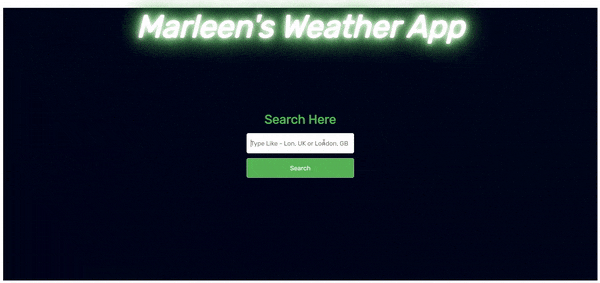

## Demo



https://marleen-weather.netlify.app/


## Installation

Install weather-app-in-react with npm

```bash
  npm install weather-app-in-react
  cd weather-app-in-react
```
    
## API Reference


| Parameter | Type     | Description                |
| :-------- | :------- | :------------------------- |
| `REACT_APP_API_KEY` | `string` | **Required**. API key from OpenWeather API |


### Link to get API key

https://rapidapi.com/community/api/open-weather-map
## Authors

- [@dipanc1](https://github.com/dipanc1)
