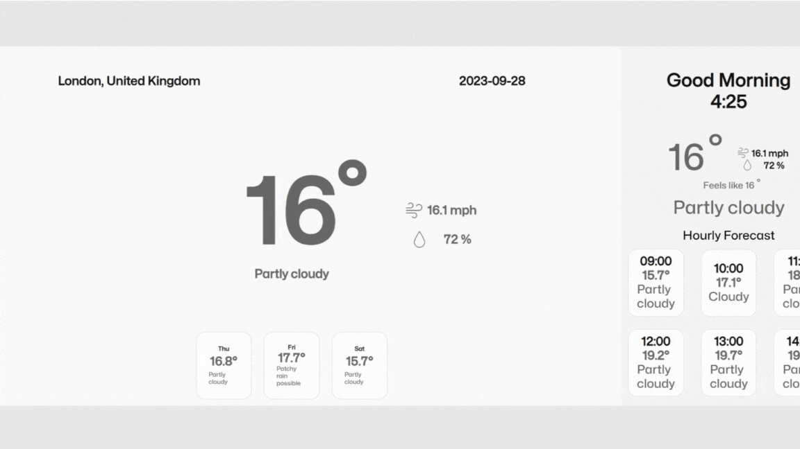

## Demo



https://marleen-weather.netlify.app/


## Usage

Download repo or clone repo

```bash
  cd weather-app-in-react
  npm install 
  npm start
```
    
## API Reference


| Parameter | Type     | Description                |
| :-------- | :------- | :------------------------- |
| `REACT_APP_API_KEY` | `string` | **Required**. API key from Weather API |


### Link to get API key

https://rapidapi.com/weatherapi/api/weatherapi-com
## Authors

- [@dipanc1](https://github.com/dipanc1)
